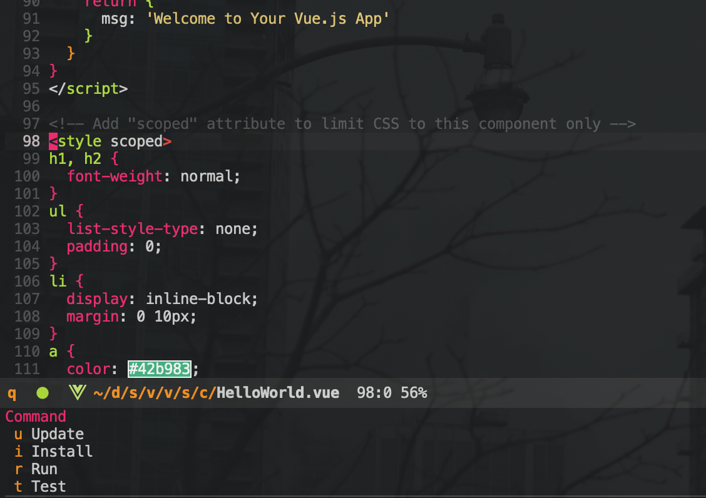

# npm.el
[](https://melpa.org/#/npm)

This is an npm client for emacs.

## Important
There is another package [npm-mode](https://github.com/mojochao/npm-mode) that serves a similar purpose to this package. npm-mode offers a way to execute npm commands quickly using key-bindings whereas this package makes use of [transient.el](https://github.com/magit/transient) to offer a more graphical user experience for interacting with npm that I find to be advantageous for exploration and in general when you aren't totally familiar with npm or your current node project. Since both packages serve a similar purpose, they both define a mode called `npm-mode` and as such there would likely be conflicts if both packages were installed. **Choose the package that best fits your desired NPM workflow**.

## Install
This package is available on MELPA

### Using `use-package`

``` emacs-lisp
(use-package npm
    :ensure t)
```

## Usage
`M-x npm`




As of right now this package only supports the `npm run, test, install, and update` commands but I hope to add more functionality soon. If you have a command you would really like to see added here please open an issue!
